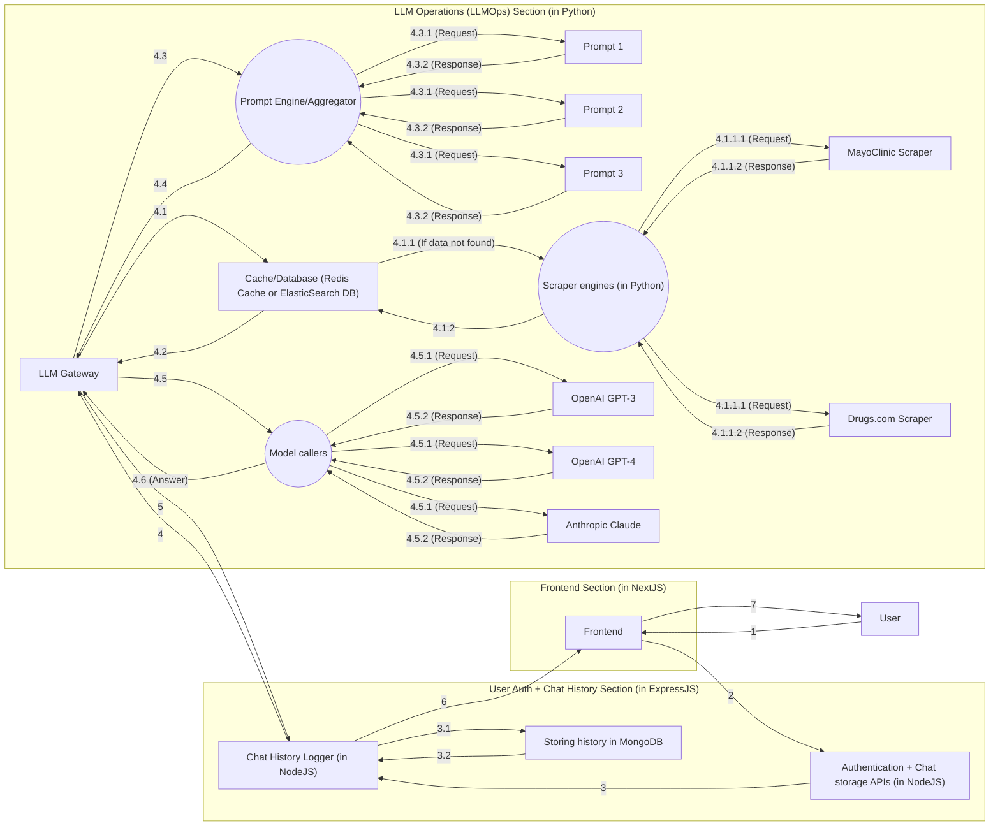

# HealthAId

    

    Imagine going to a pharmacist and seeing someone like this - how does that sound?

A next-gen model leveraging the power of the company's existing knowledge base and foundational models.

Why not leverage the power of reasoning, prompt chains, and other such innovations, to give your users the ability to chat with it? Think of interacting with a pharmacist on the fly who knows about the current status of stocks in your website.

[*Original submission (During Bajaj HackRx 4.0)*](https://github.com/hackrx40/PS1-undefined_neq_null/tree/anuran)

[**Pitch Deck**](https://pitch.com/public/a8a8e20a-f446-4d56-a1ae-9ced887e551a)

Made by Team **undefined != null** ([Abhishek](https://github.com/Abhii-Agarwal09), [Anuran](https://github.com/anuran-roy), [Dhaval](https://github.com/dhavalkolhe/dhavalkolhe) and [Samridhhi]()) with ❤️.

## Features

- **Hackable**: Want to add some other model? Sure, go ahead! Want to add new data sources? Be our guest! Want to add a new feature? Likewise, go ahead!

- **Plug-and-play**: You can use it right out of the box by just specifying the required environment variables - nothing extra needed.

- **Adaptable** - The prompts are super easy to change. You can add new prompts, and the model will adapt to it - since it's a foundational model.

## Architecture

